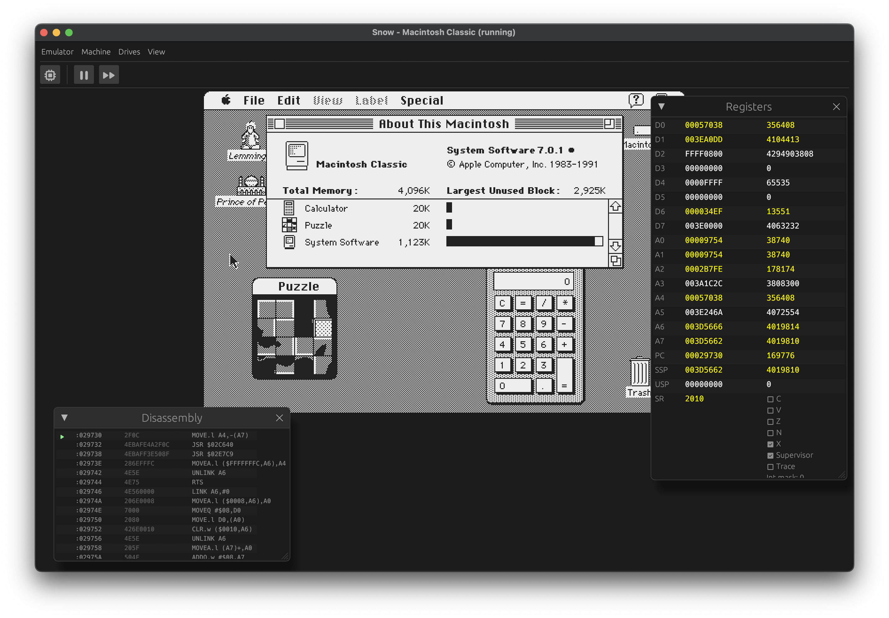

# Snow - Classic Macintosh emulator

    

Snow emulates classic (Motorola 68000-based) Macintosh computers. It features either a graphical or a simple text-based
user interface to operate and debug the emulated machine.
The aim of this project is to emulate the Macintosh on a hardware-level as much as possible, as opposed to emulators
that patch the ROM or intercept system calls.

For more information or for downloads, see the [website](https://snowemu.com/). You can view a
limited [online demo here](https://demo.snowemu.com/)

It currently supports the following models:

* Macintosh 128K/512K
* Macintosh Plus
* Macintosh SE (both non-FDHD and FDHD)
* Macintosh Classic

Currently supported hardware:

* IWM and SWIM floppy controllers
* GCR 400K/800K floppy disk drives (up to 3 on SE)
* GCR/MFM 1.44MB 'SuperDrive' floppy disk drive (currently read-only)
* SCSI hard disk drives (up to 7)
* Macintosh Real-Time Clock
* Macintosh keyboard/mouse
* ADB keyboard/mouse
* Audio output (PWM-based models)

Supported floppy image formats:

* Apple DiskCopy 4.2 (sector-based)
* Applesauce A2R 2.x and 3.x (flux)
* Applesauce MOOF (bitstream and flux)
* PCE Flux Image (PFI, flux)
* PCE Raw Image (PRI, bitstream)
* Raw images (sector-based)
* Any format (Mac 1.44MB or PC) supported by [Fluxfox](https://github.com/dbalsom/fluxfox)

## Building

See the [BUILDING.md](docs/BUILDING.md) file for instructions on building.

## Acknowledgements

* Thanks to raddad772 for the excellent [68000 JSON test suite](https://github.com/SingleStepTests/m68000)
* Thanks to Rubix for the ASCII Mac
* Thanks to Daniel Balsom for the [Fluxfox](https://github.com/dbalsom/fluxfox) library
* Thanks to the people of the Emudev and [Applesauce](https://applesaucefdc.com/) communities for their infinite wisdom
