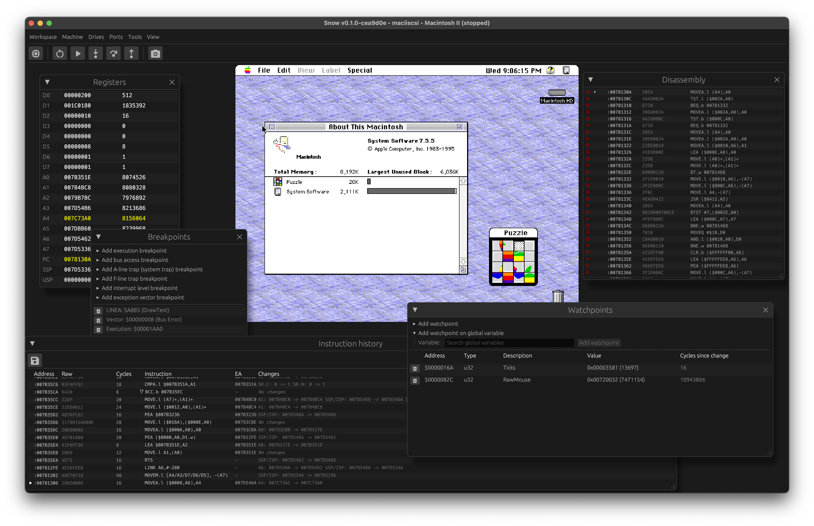

# Snow - Classic Macintosh emulator

    

Snow emulates classic (Motorola 68k-based) Macintosh computers. It features a
graphical user interface to operate and debug the emulated machine.
The aim of this project is to emulate the Macintosh on a hardware-level as much
as possible, as opposed to emulators that patch the ROM or intercept system calls.

[For more information and downloads, go to the website](https://snowemu.com/). You can view a
limited [online demo here](https://demo.snowemu.com/)

It currently supports the following models:

* Macintosh 128K/512K/512Ke
* Macintosh Plus
* Macintosh SE (both non-FDHD and FDHD)
* Macintosh Classic
* Macintosh II (both non-FDHD and FDHD)
* Macintosh IIx, IIcx, SE/30

Currently supported hardware:

* Motorola 68000, 68020, 68030 CPUs
* Motorola 68881, 68882 FPUs
* Motorola 68851 PMMU
* IWM and SWIM floppy controllers
* GCR 400K/800K floppy disk drives (up to 3 on SE)
* GCR/MFM 1.44MB 'SuperDrive' floppy disk drive (currently read-only)
* SCSI hard disk drives (up to 7)
* SCSI CD-ROM drive
* Macintosh Real-Time Clock
* Macintosh keyboard/mouse
* ADB keyboard/mouse
* Audio output (PWM-based audio on compact Macs and ASC on newer models)
* Macintosh Display Card 8-24 with various monitor types (models with NuBus)

Supported floppy image formats:

* Apple DiskCopy 4.2 (sector-based)
* Apple Disk Archive / Retrieval Tool ('DART') (sector-based)
* Applesauce A2R 2.x and 3.x (flux)
* Applesauce MOOF (bitstream and flux)
* PCE Flux Image (PFI, flux)
* PCE Raw Image (PRI, bitstream)
* Raw images (sector-based)
* Any format (Mac 1.44MB or PC) supported by [Fluxfox](https://github.com/dbalsom/fluxfox)

Debugging features:

* Breakpoints (execution, bus access, system trap, exception, interrupt level)
* Watchpoints with editing
* Single step, step over, step out
* Disassembly view
* Register view with editing
* Memory viewer with editing
* Instruction history view with export functionality
* System trap history viewer
* Peripheral debug view
* Terminal for the serial ports

Networking and interfacing features:

* TCP and PTY bridges for serial ports
* LocalTalk over UDP
* Emulated Ethernet adapter with userland NAT

## Building

See the [BUILDING.md](docs/BUILDING.md) file for instructions on building.

## Acknowledgements

* Thanks to raddad772 for the excellent [68000 JSON test suite](https://github.com/SingleStepTests/m68000)
* Thanks to Daniel Balsom for creating the Snow mascot art and for the [Fluxfox](https://github.com/dbalsom/fluxfox)
  library
* Thanks to Andrew Yaros for contributing the application icon
* Thanks to the people of the Emudev and [Applesauce](https://applesaucefdc.com/) communities for their infinite wisdom
* The [Musashi](https://github.com/kstenerud/Musashi) (by Karl Stenerud) and [MAME](https://github.com/mamedev/mame) (
  many authors) projects have been used as a reference for poorly documented components
* The BlueSCSI Toolbox protocol and software is used in and distributed with Snow with permission of Eric Helgeson
