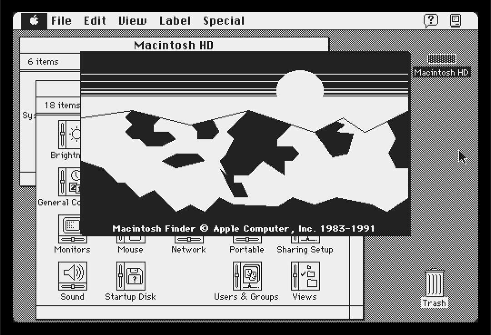
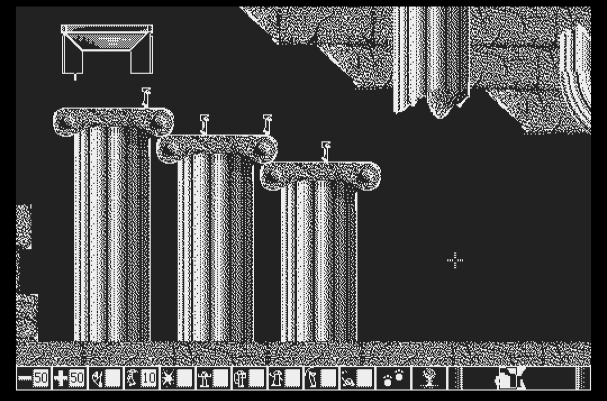
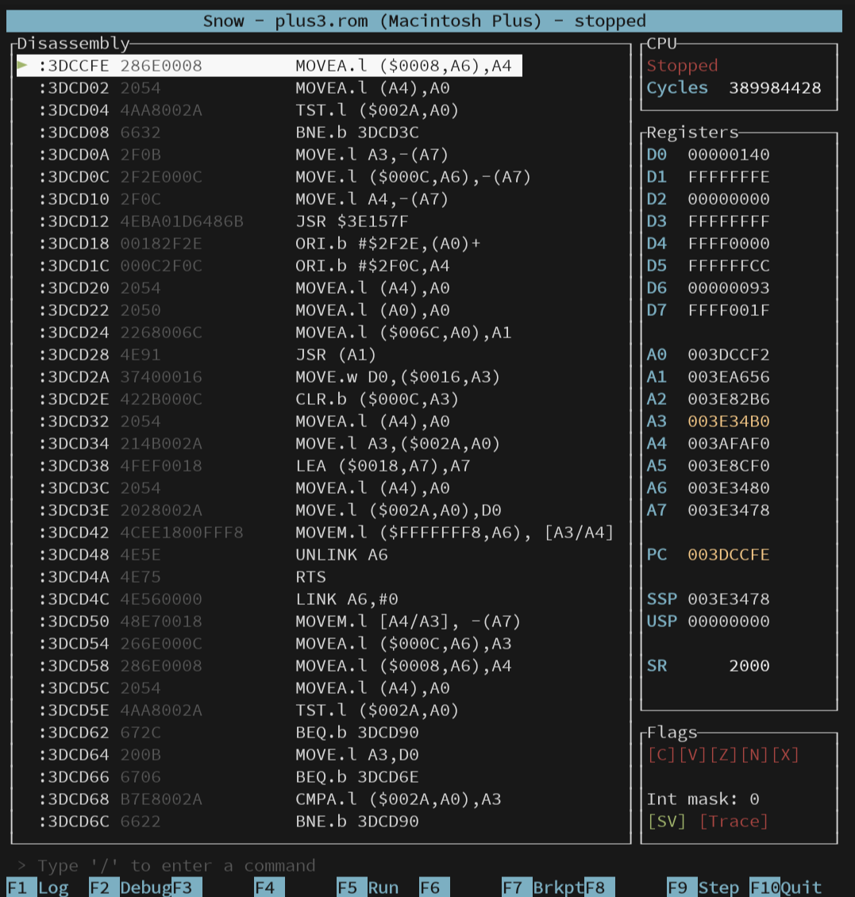

# Snow - Classic Macintosh emulator

[](https://codecov.io/github/twvd/snow) [](https://github.com/twvd/snow/actions/workflows/tests.yml) [](https://github.com/twvd/snow/actions/workflows/build_linux.yml) [](https://github.com/twvd/snow/actions/workflows/build_windows.yml)

Snow emulates classic (Motorola 68000-based) Macintosh computers. It features a simple text-based user interface
to operate and debug the emulated machine. The Macintosh graphical output is rendered using SDL 2.





It currently supports the following models:
 * Macintosh 128K/512K
 * Macintosh Plus
 * Macintosh SE (both non-FDHD and FDHD)
 * Macintosh Classic

Currently supported hardware:
 * IWM and SWIM floppy controllers
 * GCR 400K/800K floppy disk drives (up to 3 on SE)
 * GCR/MFM 1.44MB 'SuperDrive' floppy disk drive (currently read-only)
 * SCSI hard disk drives (up to 7)
 * Macintosh Real-Time Clock
 * Macintosh keyboard/mouse
 * ADB keyboard/mouse
 * Audio output (PWM-based models)

Supported floppy image formats:
 * Apple DiskCopy 4.2 (sector-based)
 * Applesauce A2R 2.x and 3.x (flux)
 * Applesauce MOOF (bitstream and flux)
 * PCE Flux Image (PFI, flux)
 * PCE Raw Image (PRI, bitstream)
 * Raw images (sector-based)
 * Any format (Mac 1.44MB or PC) supported by [Fluxfox](https://github.com/dbalsom/fluxfox)

## Building and running from source

You need a Macintosh ROM image and a floppy disk image to be able to run anything.
To build and run after checking out the source, simply run:

```
cargo run --release -- <rom image filename> [floppy image filename]
```

There are other command line options you can pass. To see a full list, run:

```
cargo run --release -- --help
```

## Usage

Snow has a text-based user interface. You can use the F1-F10 keys for various actions, depending on the screen you are on,
listed at the bottom of the screen. You can also enter commands; see 'Commands' below.

### The ROM file

You need a ROM dump of an actual machine to emulate one of the supported Macintosh models. You'll need to obtain this somehow,
I can't help you with that.

Snow will recognise each supported ROM file and internally configure the emulator to emulate the specifics of that model, e.g.
peripherals, amount of memory, memory map, etc.

### Using floppy disks

The easiest way to load floppy images is to put them in the 'floppies' directory and us the built-in floppy image browser.
In the 'Status' screen, press `1`, `2` or `3` to load an image into the respective drive.

You can also specify an image filename on the command line to have a disk inserted at startup. You can also use the
`/disk1`, `/disk2` and `/disk3` commands to load an image, see below.

Writes to floppy disks are not automatically persisted. You can save a new image with the changes you made using `/writedisk1`
or `/writedisk2`.

Snow supports a variety of image formats that are sector-, bitstream- as well as flux-based.
See above for supported image formats. Writing to images that have tracks with flux accuracy is currently not supported -
these images will be mounted write protected.

### Using hard drives

On models with SCSI, Snow can emulate SCSI hard drives. On startup, it will look for files using the `hddN.img` file naming
convention, where `N` is a number between 0 and 6, inclusive. For example, to use a disk image for a hard drive at SCSI ID 3,
name your file `hdd3.img`.

To create an empty disk, just create a file of the correct size (must be a multiple of 512 due to the block size). On Linux, you
can use the following command to create an empty 20MB hard drive image:

`dd if=/dev/zero of=hdd2.img bs=1M count=20`

You can then initialize the drive in the emulator using the 'HD SC Setup' tool. This tool is found on the 'System Tools' disks
from Apple.

## Commands

You can control the TUI using the keys outlined in the interface.
Additionally, you can enter the following commands: 

### Emulator control
 * `/speed <mode>` - changes emulation speed mode. Possible modes are:
   * `accurate` - accurate to real hardware,
   * `dynamic` - accurate when playing sound, otherwise uncapped,
   * `uncapped` - run as fast as possible (sound is disabled).
 * `/exit` / `/quit` - terminates the emulator.

### Media related commands
 * `/disk1 <filename>` - mounts the specified disk image and inserts it into the internal drive.
 * `/disk2 <filename>` - mounts the specified disk image and inserts it into the external drive.
 * `/disk3 <filename>` - mounts the specified disk image and inserts it into the secondary internal drive (if available).
 * `/writedisk1 <filename>` - saves the currently or last inserted disk in the internal drive, including changes, as file.
 * `/writedisk2 <filename>` - saves the currently or last inserted disk in the external drive, including changes, as file.
 * `/writedisk3 <filename>` - saves the currently or last inserted disk in the secondary internal drive (if available), including changes, as file.

### Debugging related commands
 * `/b <address in hex>` - sets a breakpoint.
 * `/dasm <address in hex>` - shows a disassembly from the specified address in the debugger.
 * `/loadbin <address in hex>` - loads the specified file (entirely) into the emulated memory starting from the specified address.
 * `/setpc <address in hex>` - sets the CPU's program counter to the specified value.

## Acknowledgements
 * Thanks to raddad772 for the excellent [68000 JSON test suite](https://github.com/SingleStepTests/m68000)
 * Thanks to Rubix for the ASCII Mac
 * Thanks to Daniel Balsom for the [Fluxfox](https://github.com/dbalsom/fluxfox) library
 * Thanks to the people of the Emudev and [Applesauce](https://applesaucefdc.com/) communities for their infinite wisdom
