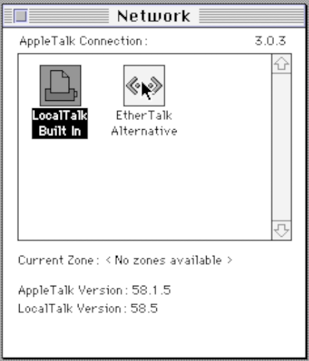

# Tap bridge network setups

The paragraphs below serve as examples of how to configure networking on Linux to allow your emulator to connect
to other emulated systems or the outside world. You'll still need some idea of what you're doing to tailor these
examples to something that works for your desired setup.

Some things worth understanding:

- [Ethernet (Snow user manual)](../manual/network/ethernet.md)
- [Network bridge (Arch Linux wiki)](https://wiki.archlinux.org/title/Network_bridge)

<div class="warning">
Messing with your network configuration may leave you without an internet connection on your system. Make sure you can
revert whatever changes you are making.

Services such as Network Manager may revert or tamper with some of your changes. It is better to disable them upfront.
</div>

Note that to use EtherTalk, you need to configure MacOS within the emulated system as such (by default, it uses
LocalTalk). Go to Control Panels -> Network and select EtherTalk:



## Example: host as internet gateway

The example sets up your host system to be an internet gateway for a single emulator. In this example, the host system
has IP address 10.0.0.1. Give the emulator an IP address in the range `10.0.0.2` - `10.0.0.254`. Use an external
DNS server (e.g. Google DNS: `8.8.8.8`).

Replace `eth0` with the name of your network interface.

```shell
# Bring tap interface up and assign an IP
sudo ip addr add 10.0.0.1/24 dev tap0
sudo ip link set tap0 up

# Allow forwarding between tap0 and eth0
sudo sysctl -w net.ipv4.ip_forward=1
sudo iptables -A FORWARD -i tap0 -o eth0 -j ACCEPT
sudo iptables -A FORWARD -i eth0 -o tap0 -m state --state RELATED,ESTABLISHED -j ACCEPT
sudo iptables -t nat -A POSTROUTING -o eth0 -j MASQUERADE
```

## Example: bridging your host's network interface and the emulator

This setup will make the emulator a layer 2 participant on your host system's network, just like any other device
attached to that network. This will allow you to use AppleTalk (EtherTalk) with real Macintosh systems.

In this setup, you will need to assign your emulated system an IP address within the same network as your host is in.
The gateway is the same as you use on your host.

Note that by attaching your network interface to a bridge interface, _you will need to re-configure your hosts IP
configuration on the bridge interface, instead!_ This is due to the way bridges work in Linux.

```shell
# Prepare bridge interface (br0)
sudo ip link add dev br0 type bridge
sudo ip link set dev br0 up

# Remove the IP address from your real network interface and attach it to the bridge
sudo ip addr flush dev eth0
sudo ip link set dev eth0 master br0

# Create tap interface for the emulator and attach it to the bridge
# If you want to network multiple emulator instances, 
# just repeat this for tap1, tap2, etc.
sudo ip tuntap add dev tap0 mode tap user $UID
sudo ip link set dev tap0 master br0
sudo ip link set dev tap0 up

# Now, you need to reassign your host's IP address to the bridge interface.
# You can also setup DHCP client on the bridge interface, if you prefer.
sudo ip addr add dev br0 <host IP/CIDR>
# You also need to re-add your gateway to the routing table
sudo ip route add default via <host gateway>
# You will probably also need to re-configure your DNS servers.
# After this you should verify you have your internet and 
# network connectivity back on your host.
```