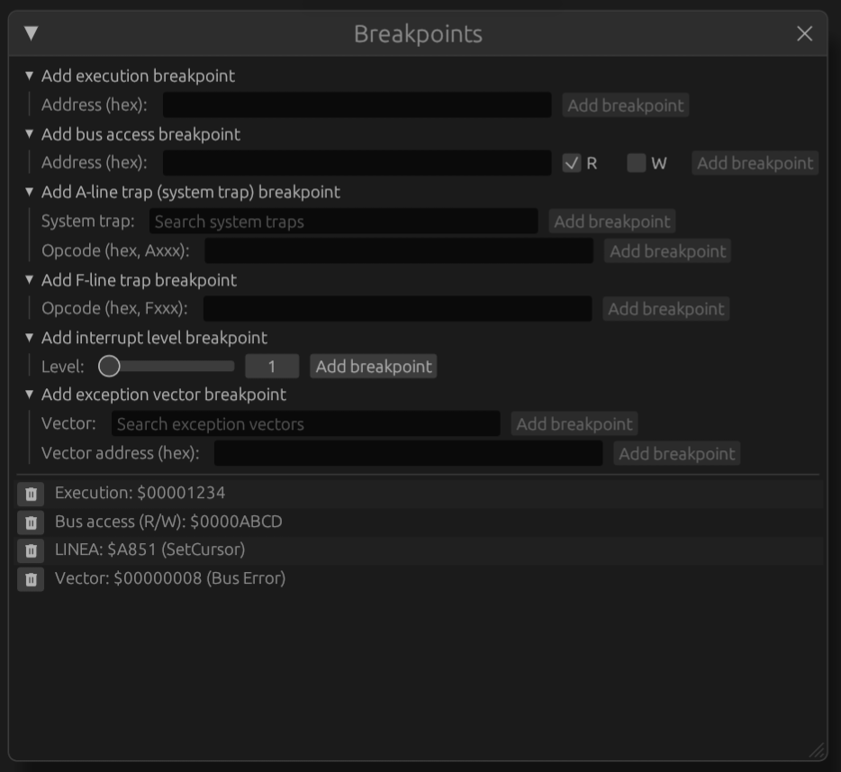
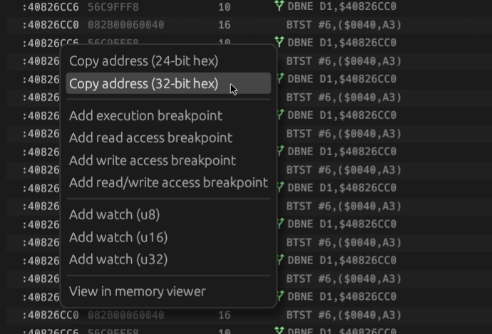

# Breakpoints

Snow supports several types of breakpoints:
 * Execution breakpoints: breaks execution when PC arrives at a certain location
   in the execution flow.
 * Bus access breakpoints: breaks when the CPU reads or writes a specified bus
   address.
 * A-line/system trap breakpoint: breaks when a certain A-line instruction is
   executed. The Macintosh uses these unimplemented instructions as 'system traps'
   or 'system calls'.
 * F-line trap breakpoint: breaks when a certain unimplemented F-line instruction
   is executed. The 68k CPUs used this instruction prefix for co-processor
   instructions (e.g. FPU or PMMU). Note that this will only break on _unhandled_
   F-line instructions that will call the trap handler and will not break on e.g.
   a valid FPU instruction.
 * Interrupt level breakpoint: breaks when the CPU's interrupt level is raised (by
   hardware); e.g. when an autovector interrupt of a certain level is raised.
 * Exception vector breakpoint: breaks when the CPU jumps to the specified
   exception vector.

## Managing breakpoints

To set new and manage current breakpoints, open the Breakpoints dialog using the
'View > Breakpoints' menu item.

Use the appropriate dropdown to manually add breakpoints. To remove a breakpoint,
click the delete button.

## Adding breakpoints

Breakpoints can be added manually using the Breakpoints dialog but also added by
right-clicking an address visible anywhere in the user interface and clicking
a context menu item:

Execution breakpoints can also be added or removed by clicking the red circle in
the [disassembly](disassembly.md) view.
