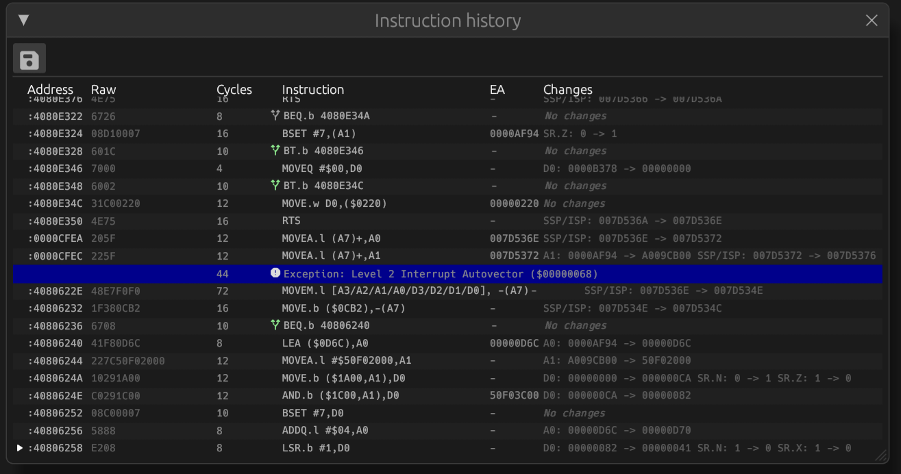

# Instruction history

The instruction history view shows a trace of the instructions executed by the
CPU and the effect of these instructions. The instruction history view can be
opened using the 'View > Instruction history' menu item.

As long as the 'Instruction history' dialog is open, additional trace
functionality is enabled in the emulator core which impacts performance
of the emulator. It is recommended to only keep the instruction history
window open for as long as it is needed.

The instruction history dialog has the following actions in the toolbar:
 * save - exports the trace to
   a pipe-separated file.

In the table the last executed instruction is shown at the bottom.
The table in the dialog shows the following columns:
 * play_arrow -
     last instruction to be executed
 * Address: the address the instruction was fetched from.
 * Raw: complete instruction in hex format
 * Cycles: amount of CPU clock cycles spent on this instruction.
   An hourglass_top
   icon indicates that wait states were incurred during instruction or data
   fetch for this instruction.
   If the CPU has I-cache and it is enabled, a cache state indicator will appear
   in front of the cycles cell:
    * speed
      indicates a cache hit for the entire instruction,
    * speed
      indicates a cache hit for part of the instruction,
    * speed
      indicates a cache miss for the entire instruction.
 * Instruction: text representation of the instruction. A-line instructions are
   annotated with the name of the system trap.
   On branch instructions, a branch indicator shows if the branch was taken:
    * alt_route
      indicates the branch taken,
    * alt_route
      indicates the branch was not taken.
 * EA: calculated Effective Address on which the operation of the instruction
   was executed. This may be empty if the instruction does not operate on memory
 * Changes: a list of CPU registers and flags that were changed by the instruction
 
## Exceptions and interrupts
If during execution an exception or interrupt is raised and the CPU jumps to
the handler, a row with a blue background color is shown in the instruction history
table naming the exception or interrupt that was raised and the amount of cycles
taken.
