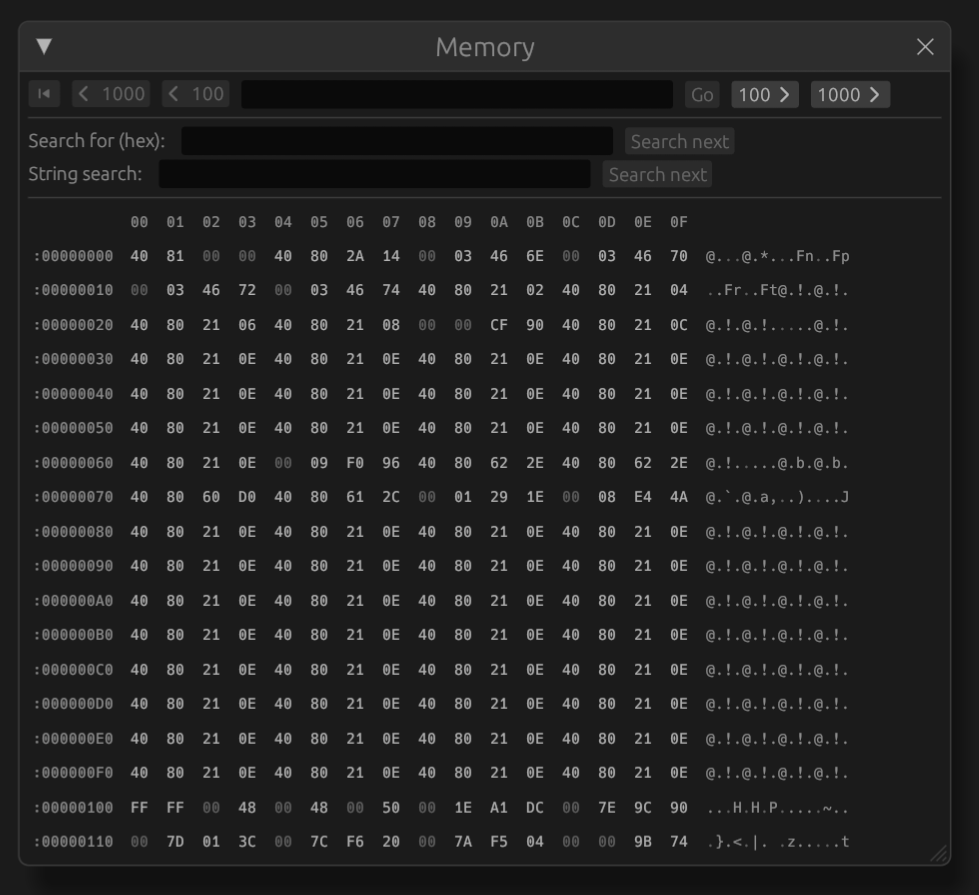
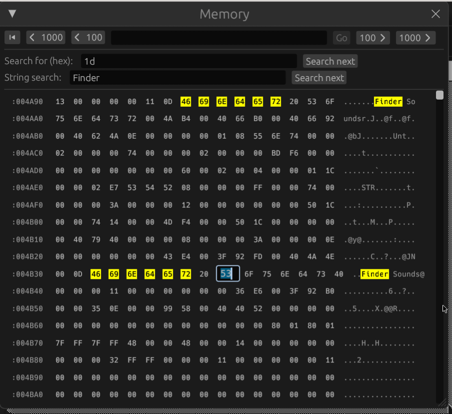

# Memory viewer

The memory viewer allows viewing and editing system RAM of the emulated
system.

The viewer can be opened through the 'View > Memory' menu item.

The table shows the address of the leftmost byte in the first column. Following
addresses can be identified by the byte ruler at the top. Hexadecimal values of
each byte show in the middle and to the right an ASCII-representation of the 16
bytes is shown.

When a value has been changed recently, the value text lights up in yellow.

## Navigating memory

To skip to an address, enter the address in the top textbox (in hexadecimal)
and click 'Go'. The skip_previous
button skips back to the beginning of the RAM (address 0) and the
skip_next button skips to the end.
The other buttons skip backwards or forwards by $100 or $1000 bytes.

## Editing memory

To edit a value, simply click on it, change the value in the textbox that
appears and press ENTER or click anywhere. To cancel editing press ESCAPE.

## Searching

Snow provides two search options:

 * Searching for a hexadecimal value (of any length). Enter the value in the
   'Search for (hex)' textbox and click 'Find next'.
 * Searching for (ASCII) strings. Enter the string to be found in the
   'String sewrch' textbox and click 'Find next'.

Searching will always start from the top address currently shown in the
viewer and will wrap-around when the end of memory is reached. The search
needle will be highlighted in the memory viewer with a yellow background color.

