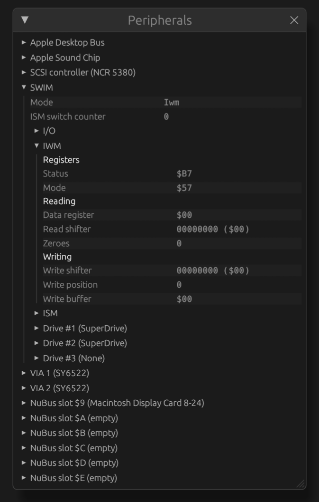

# Peripherals

The peripherals debug view shows registers and other state of system components,
such as the VIA, SCC, NuBus cards and other components. The shown components
differ depending on which Macintosh model is emulated and the enabled options.

To open this view, use the 'View > Peripherals' menu item.

As long as the 'Peripherals' dialog is open, additional trace
functionality is enabled in the emulator core which impacts performance
of the emulator. It is recommended to only keep this window open for as long
as it is needed.

The window contains a tree view of items. The arrows in front of items can be
used to expand them and view sub-items.
