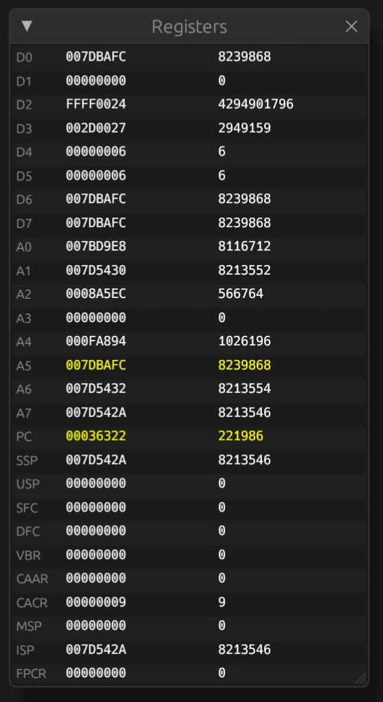

# Registers

The registers view shows the current register state of the emulated CPU.
It can be opened using the 'View > Registers' menu item.

The first column shows the register name, the second column shows the current
value in hexadecimal and the third column shows the current value in decimal.

If a value has changed since the last update, that value shows in yellow.

Right-clicking on the value of an address register, stack pointer or program
counter opens a context menu with common actions for addresses.

## Editing

To edit a register value, left click on the hexadecimal value of a register and
edit the hexadecimal value. Pressing ENTER or clicking anywhere applies the
change. To cancel the change, press ESCAPE.
