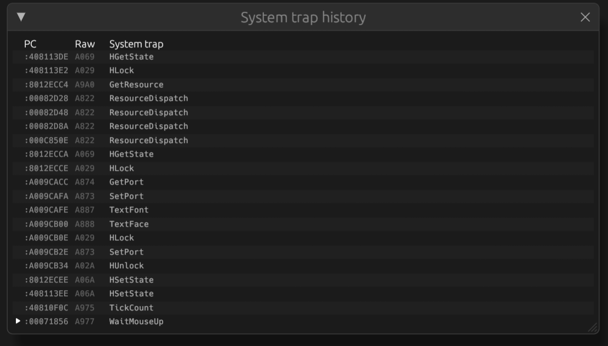

# System trap history

The system trap history view shows a trace of the system traps executed by the
emulated system.

The system trap history view can be opened using the 'View > System trap history' menu item.

As long as the 'System trap history' dialog is open, additional trace
functionality is enabled in the emulator core which impacts performance
of the emulator. It is recommended to only keep the system trap history
window open for as long as it is needed.

In the table the last executed system trap is shown at the bottom.
The table in the dialog shows the following columns:
 * PC: the address the A-line instruction was fetched from
 * Raw: complete instruction in hex format
 * System trap: the name of trap
