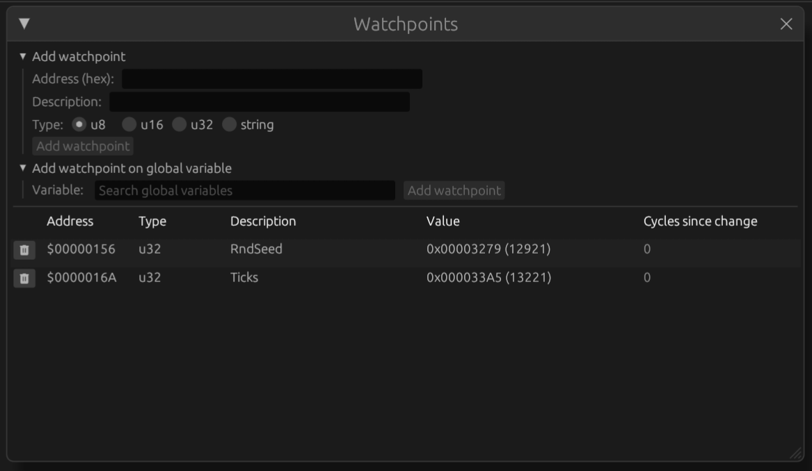
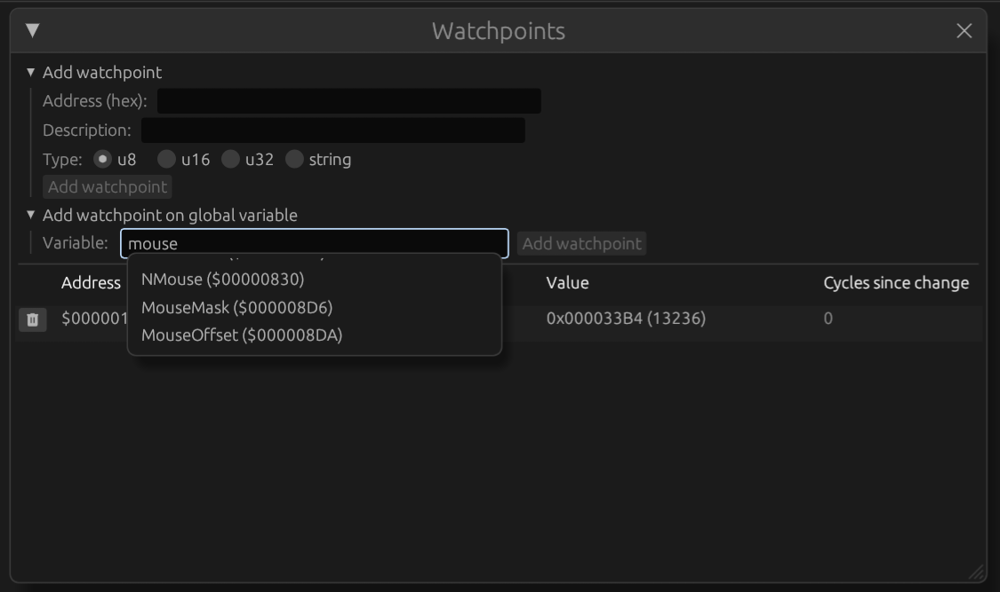

# Watchpoints

To set up watchpoints, either right-click on an address anywhere in the UI
to open a context menu with options to add watchpoints, or open the
'Watchpoints' dialog through the 'View > Watchpoints' menu item.

In the dialog you can add watchpoints and view existing ones. The columns
contain the address of the watchpoint (in hexadecimal), an optional
description, the current value and how many CPU cycles have passed since it
was last changed.

A watchpoint of which the value recently changed lights up in yellow.

## Adding watchpoints

You can add a watchpoint on any address shown in the UI by right-clicking
it and selecting 'Add watch'.

You can also expand the 'Add watchpoint' dropdown in the 'Watchpoints'
dialog, enter an address, data type and optional description and click
'Add watchpoint'.

Snow includes a catalog of static global variables used by the Mac ROM and
MacOS operating system. When you open the 'Add watchpoint on global variable'
dropdown, you can search for the names of globals, see their description and
data type and add them as watchpoint immediately.

## Removing watchpoints

Click the delete button to
remove a watchpoint.
