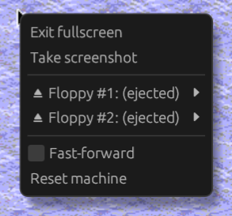

# Fullscreen mode

To enter fullscreen mode, click the <span class="material-symbols-rounded">fullscreen</span>
toolbar button or use the 'View > Enter fullscreen' menu item.

While in fullscreen mode, right-click to open a context menu to exit fullscreen
or perform other emulator actions.



When working mostly in fullscreen mode or when playing games in fullscreen mode,
use [relative mouse positioning mode](input.md#mouse) for the best experience.

## Starting in fullscreen mode

To start Snow in fullscreen mode, you can use the `-f` or `--fullscreen`
command line argument. You have to specify a workspace or ROM to load
when starting in fullscreen mode. For example:

```
./snowemu -f mymac.snoww
```
```
./snowemu -f macplus.rom
```
