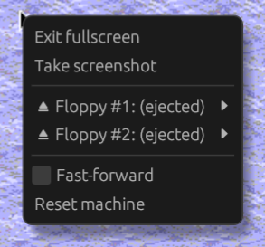

# Fullscreen and Zen mode

To enter fullscreen mode, click the <span class="material-symbols-rounded">fullscreen</span>
toolbar button or use the 'View > Enter fullscreen' menu item.

While in fullscreen or Zen mode, right-click to open a context menu to exit fullscreen
or perform other emulator actions. A toast will remind you of this every time
fullscreen mode or zen mode is activated. To enable or disable this toast, use the
'Options -> Hide fullscreen/zen mode toasts' or click 'Do not show again' when the
toast shows.



When switching to fullscreen mode, Snow will automatically switch to
[relative mouse positioning mode](input.md#mouse) to provide the best experience
and back to the original mode when leaving fullscreen. This behavior can be
enabled/disabled using the 'Options > Use relative mouse in fullscreen' menu option.
This option persists globally.

## Zen mode

Zen mode is basically identical to fullscreen mode, except Snow stays windowed
rather than expanding to be fullscreen and the mouse emulation mode remains
untouched.

To enter Zen mode, click the <span class="material-symbols-rounded">filter_center_focus</span>
toolbar button or use the 'View > Enter Zen mode' menu item.

## Starting in fullscreen/Zen mode

To start Snow in fullscreen mode, you can use the `-f` or `--fullscreen`
command line argument. You have to specify a workspace or ROM to load
when starting in fullscreen mode. For example:

```
./snowemu -f mymac.snoww
```
```
./snowemu -f macplus.rom
```

For Zen mode, use `--zen` instead.
