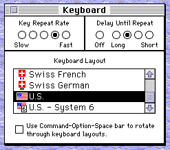

# Keyboard/mouse

## Keyboard

For non-ADB Macintosh models (128K, 512K, 512Ke and Plus), Snow emulates the
Apple M0110 keyboard with the following layout:

```  
,---------------------------------------------------------.
|  `|  1|  2|  3|  4|  5|  6|  7|  8|  9|  0|  -|  =|Backs|
|---------------------------------------------------------|
|Tab  |  Q|  W|  E|  R|  T|  Y|  U|  I|  O|  P|  [|  ]|  \|
|---------------------------------------------------------|
|CapsLo|  A|  S|  D|  F|  G|  H|  J|  K|  L|  ;|  '|Return|
|---------------------------------------------------------|
|Shift   |  Z|  X|  C|  V|  B|  N|  M|  ,|  .|  /|        |
`---------------------------------------------------------'
     |Opt|Mac |         Space               |Enter|Opt|    
     `------------------------------------------------'    
```

For Macintosh models with ADB, Snow emulates the Apple extended keyboard
M0115 with the following "U.S. Domestic" layout:

```
,---.   .---------------. ,---------------. ,---------------. ,-----------.             ,---.
|Esc|   |F1 |F2 |F3 |F4 | |F5 |F6 |F7 |F8 | |F9 |F10|F11|F12| |PrS|ScL|Pau|             |Pwr|
`---'   `---------------' `---------------' `---------------' `-----------'             `---'
,-----------------------------------------------------------. ,-----------. ,---------------.
|  `|  1|  2|  3|  4|  5|  6|  7|  8|  9|  0|  -|  =|Backspa| |Ins|Hom|PgU| |NmL|  =|  /|  *|
|-----------------------------------------------------------| |-----------| |---------------|
|Tab  |  Q|  W|  E|  R|  T|  Y|  U|  I|  O|  P|  [|  ]|  \  | |Del|End|PgD| |  7|  8|  9|  -|
|-----------------------------------------------------------| `-----------' |---------------|
|CapsLo|  A|  S|  D|  F|  G|  H|  J|  K|  L|  ;|  '|  Return|               |  4|  5|  6|  +|
|-----------------------------------------------------------|     ,---.     |---------------|
|Shift   |  Z|  X|  C|  V|  B|  N|  M|  ,|  ,|  /|Shift     |     |Up |     |  1|  2|  3|   |
|-----------------------------------------------------------| ,-----------. |-----------|Ent|
|Ctrl |Opt | Cmd |        Space            | Cmd |Opt |Ctrl | |Lef|Dow|Rig| |      0|  .|   |
`-----------------------------------------------------------' `-----------' `---------------'
```

These are currently the only keyboard layouts supported. If you experience
issues with incorrect key presses inside the emulated system, particularly with
localized operating systems, change the keyboard layout to "U.S." or "U.S. Domestic"
(Apple menu > Control Panel > Keyboard).



### Command key

To use the Command key on a MacOS host, you can simply use the Command
button on the host system.

On Windows and Linux hosts, you can use the right ALT key. The 'Super' key
(the Windows key) is also mapped to the Command key, but this key is often
not forwarded by the operating system. On Windows, you can use SHIFT+WIN to
press the Command key, but since this is rather inconvenient, Snow provides
the right ALT as an alternative.

To enable or disable mapping the right ALT to Command, use the menu item
'Options > Map right ALT to Cmd'. This option is saved in the [workspace](./workspaces.md).

## Mouse

Snow supports two ways of emulating the mouse, which can be chosen under
'Advanced' in the [Load ROM dialog](starting.md).

### Absolute positioning (default)

Absolute mouse positioning to provide an intuitive way of using
the mouse. Moving the mouse cursor over the display of the emulated
system will move the mouse on the emulated system. When entering the edge of
display, the cursor will immediately jump to that location. The speed of
the mouse matches that of the host system.

To achieve this, Snow patches a couple of global variables in the memory of the
Mac. This makes this mode unsuited for certain games and non-original operating
systems and ROMs.

### Relative positioning / hardware mouse emulation

This mode emulates the Macintosh mouse on the lowest level, but since hardware
mice only signal relative movement to the computer, it only passes relative
movements to the emulated system. This may make it harder to control the mouse,
but it provides the most accurate emulation experience and works best with
some games (e.g. first person shooters) and non-original software.

Relative positioning mode works best when using Snow [fullscreen](fullscreen.md).
