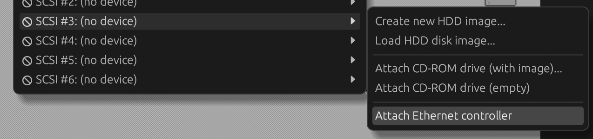
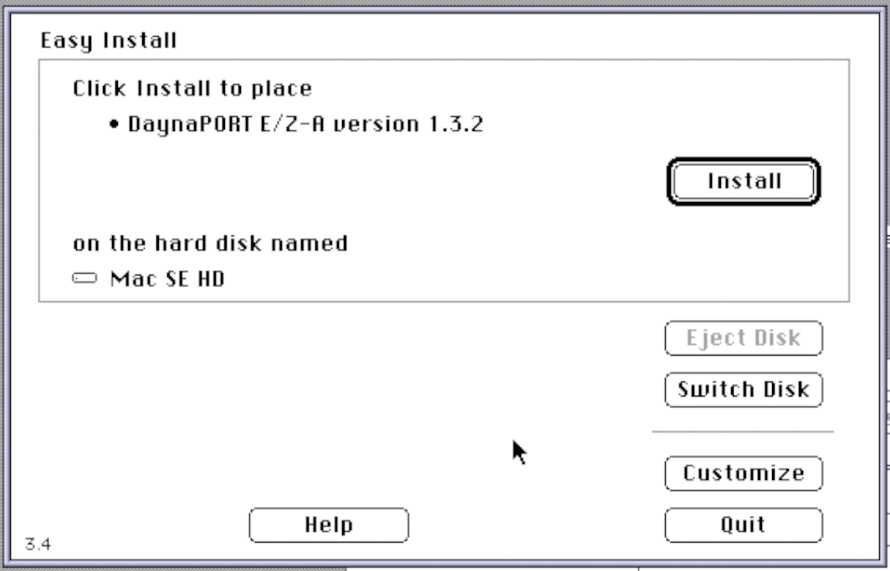
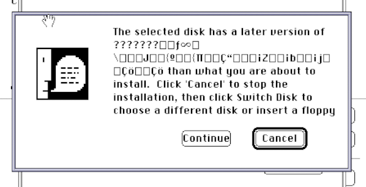
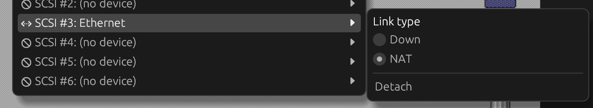
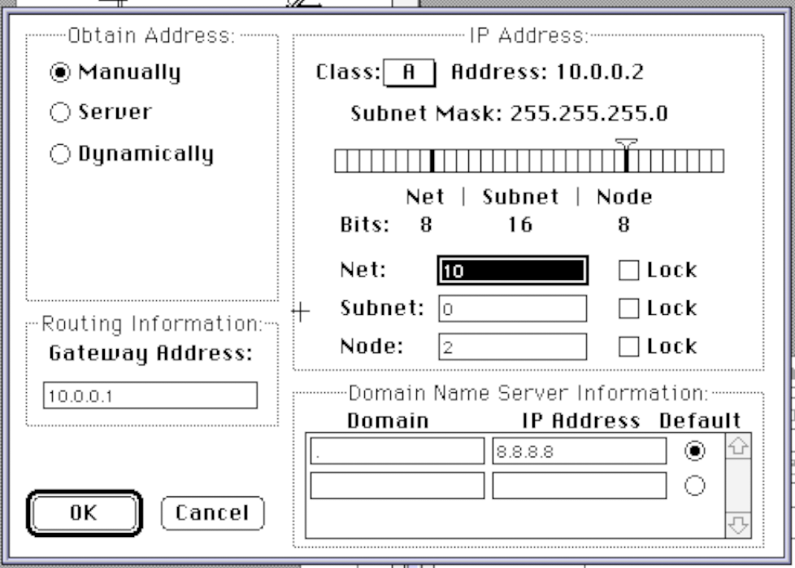
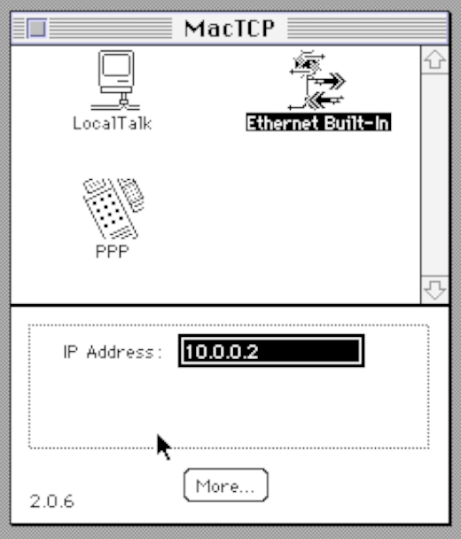

# Ethernet

Snow can emulate the DaynaPORT SCSI/Link Ethernet adapter which is an ethernet adapter with a SCSI interface. You
can use this adapter on any emulated Mac model that supports SCSI.

## Installation

To attach the emulated Ethernet adapter, use the 'Attach Ethernet adapter' option at any given SCSI ID in the menu:
'Drives' -> 'SCSI ID #<n>' -> 'Attach Ethernet adapter'.

Known issue: DaynaPORT drivers may not recognize the adapter. If you come across this, try to attach the Ethernet adapter
to SCSI ID 3 and your hard drive to ID 0.

Next, you will need to install the following in your emulated system:

* DaynaPORT drivers - the recommended (and tested) driver version is 7.5.3.
* MacTCP - 2.0.6 or higher is recommended.

### Installing DaynaPORT drivers

Use the Installer on the DaynaPORT driver disk. It will automatically select the correct driver for the adapter, which
is why you need to install the drivers _after_ attaching the Ethernet adapter (and rebooting).

During the installation, you may see the warning below. You can simply ignore this by clicking 'Continue'.

Once the drivers are installed, reboot.

### Installing MacTCP

To install MacTCP, simply drag the extension and control panel onto the System folder in your emulated system. Reboot
afterwards.

## Ethernet links

Snow currently supports a NAT-based ethernet link that runs in userland on the host system. This link only supports
TCP and UDP connections.

You can select the Ethernet link type through the Drives menu: 'Drives' -> 'SCSI ID #<n>'.

### Configuring the emulated system for NAT

The NAT link emulates a gateway at IP-address 10.0.0.1. Your emulated system needs to have any IP-address in the
10.0.0.0/8 network.
There is no DNS or DHCP emulation, so you need to configure this manually and use an external DNS server (e.g. Google or
Cloudflare DNS).

To set this up in MacTCP, open the MacTCP control panel, select 'Ethernet Built-In' and click the 'More' button to get
to the following screen:

In the 'Class' dropdown, select 'A'. Enter 10.0.0.1 as Gateway address in the bottom right input box. Enter DNS
information to use the DNS server of your choice. Then click 'OK'.

In this screen, enter the IP-address for the emulated system, which needs to be in the 10.0.0.0/8 network (for example:
10.0.0.2). Close the MacTCP control panel and reboot the emulated system. You should now be able to go online within
the emulated system.