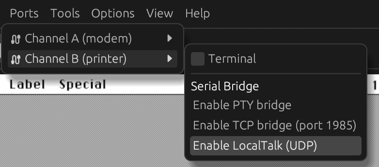
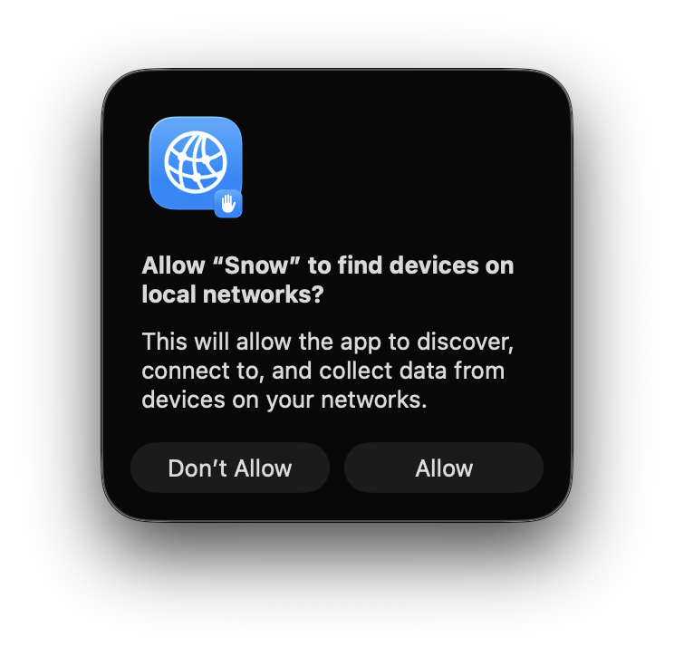

# LocalTalk over UDP

Snow supports bridging LocalTalk over UDP multicast ('LToUDP'), compatible with other emulators that implement this and
real Mac hardware through an adapter such as the [TashTalk](https://github.com/lampmerchant/tashtalk).

By default, MacOS will use serial port B for LocalTalk. To enable LToUDP, enable the bridge through the
'Ports' -> 'Channel B (printer)' -> 'Enable LocalTalk bridge'.

## Network information

On the network, LToUDP uses multicast address 239.192.76.84 and port 1954. The protocol is UDP.

## Troubleshooting

When running Snow on MacOS, you may see the following prompt to allow permission to discover devices on the local
network. Approve this prompt.

