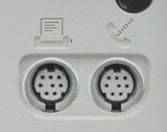
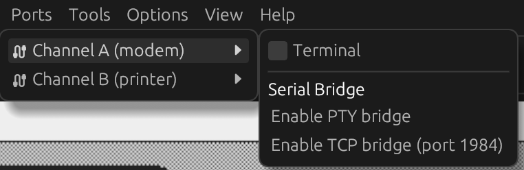
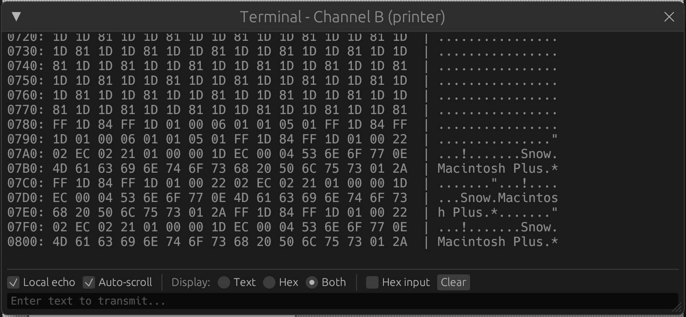

# Ports

Snow emulates and provides connectivity on the serial ports (modem and printer port) commonly found on 68k Macintosh
models.

You can either use a terminal window to talk to the emulated system directly, or expose the ports to the host operating
system by enabling a TCP server or creating a virtual serial port (MacOS or Linux only).

## Bridging a port to a TCP server

To expose a port as TCP server, use the 'Ports -> ... -> Enable TCP bridge' menu item. Snow will listen to connections
on port 1984 or 1985 for the modem or printer port, respectively. Snow will listen for connections on all available
interfaces and IP-addresses. Only a single connection per port is supported, additional connections will be rejected.

## Bridging a port as virtual serial port (PTY)

To expose a port as TCP server, use the 'Ports -> ... -> Enable PTY bridge' menu item. The menu will now show the device
filename of the virtual serial port for use in your host operating system. On Linux, this is commonly `/dev/pty/<nn>`
and
on MacOS `/dev/ttys<nnn>`.

## Using the built-in terminal

Snow provides a simple terminal to send and receive data on the ports. To view these windows, use the
'Ports -> ... -> Terminal' menu item.

To transmit data, type text in the input box and press Enter. You can also input hexadecimal numbers by enabling the
'Hex input' checkbox and entering, for example, `53 6E 6F 77`.

Note that the terminal window has a limited buffer size and is mostly ment for simple debugging and experiments. For
more
advanced use, use the bridging options.