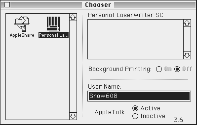

# Printing

Snow supports printing through an emulated LaserWriter IISC.

## Driver

For better compatibility, it's best to use the driver that goes with your System Software.

There is a few variants:

- `LaserWriter IISC` (for up to early System 6), version 1.x
- `Personal LaserWriter SC` (6.0.8 and up to 7.5.0), version 7.0 or 7.0.1
- a floppy named `Personal LW SC 7.0.1`, with a driver named `Personal LW SC`

You do not need to install the main LaserWriter suite, which is for PostScript printers.

According to KB030514, Apple deprecated the driver starting System 7.5.1. Although it's possible to use the driver with later versions, it may produce unacceptable results: characters and words may not have the proper spacing and lines may get clipped

## Chooser

To select the printer, just choose the printer in the chooser. It will not display anything in the list like you would normally expect.

The driver will scan the SCSI bus every time you print something (scan order: 4, 3, 2, 1, 0, 6, 5).

It means that as long as a compatible driver is installed, you can attach a printer and it will work without restarting the Mac.

## Printing

Printing is done like you would do with a real LaserWriter IISC.

Snow saves a PNG file with the current time and date (e.g. `Snow print 2026-05-02 19:52:02.png`) to your desktop.
