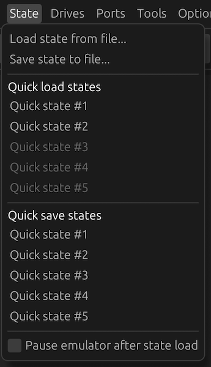

# Save states

Save states are a complete snapshot of the entire state of the emulated system into
a file. This allows you to resume an emulation session from any point where you
saved. This can be useful while debugging (to rewind quickly to a point in time),
while playing a game (rewind to an earlier point in your game) or to quickly resume
an emulation session after closing Snow.

You can save and rewind from either quick save slots or from files from the 'State'
menu in the menu bar.

By default when loading a save state the emulator will start running immediately.
To pause the emulator when a save state is loaded, tick the 'Pause emulator after state load'
checkbox in the menu. This option is saved in the [workspace](../manual/workspaces.md).

## Loading/saving state from quick save slots

To save to a quick save slot, click the slot under the 'Quick save states' header in
the menu. If there is an existing save in the slot, it is overwritten.

To load a save state from a quick save slot, click the slot under the 'Quick load states'
header in the menu. A slot can only be selected if there is a save in the slot.

Quick save slots are saved as temporary files which are deleted when Snow exits,
and therefore lost. If you need to keep a save state, save it to a file, instead.
During the session they can be used even across different emulated models and
also persist when a different [workspace](../manual/workspaces.md) is loaded.

## Loading/saving state from files

Save states can also be saved to files to persist them even after Snow exits. Use
the 'Load state from file...' and 'Save state to file...' options to load or save,
respectively.

Save states use the .SNOWS extension. They include a screenshot that shows in
the state loading file browser dialog. State files are compressed to save disk space.

State files are not guaranteed to work across different Snow versions. It is not
recommended to load a state file from a different Snow version, you may run into
issues, even if loading the state file seems to succeed.

Snow will show a warning in the file browser to indicate when a state file is
selected that was not created by the same version.

## Disk images and save states

A snapshot of every [disk image](../manual/media/) (hard drives and CD-ROM)
is packed into the save state when it is saved. This allows rewinding to an earlier
state of the image without having to worry about inconsistencies if the disk image
gets modified by the emulated system later on.

When a save state is reloaded, each disk image snapshot is re-created as a temporary
file, which is lost when Snow exits. This means, if you have loaded a save state and
want to keep the disk image from after the state load, you **must** 
[branch off the disk image to another (new) file](../manual/media/harddrives.md#branching-off-an-image).

Floppy images are also stored in the save state but are never actively written back as
the emulator runs and therefore do not need special attention.
