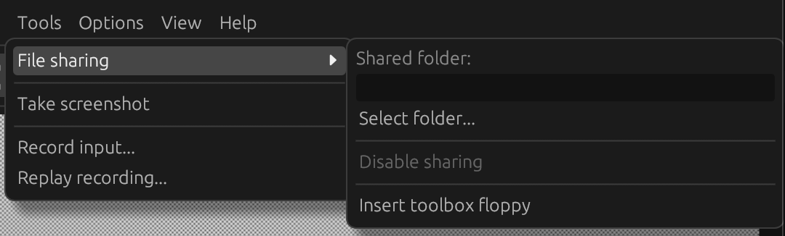
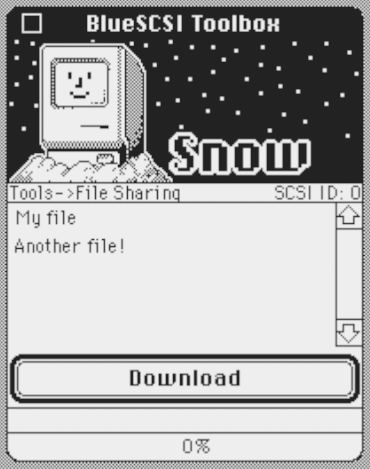

# File sharing

Snow supports the [BlueSCSI Toolbox](https://bluescsi.com/toolbox) protocol to easily share files with the emulated
system. This requires emulating a Macintosh model that has SCSI and at least one SCSI device attached.

To get started, create a folder with files you'd like to share with the emulated system, place some files in there and
select the folder in the Tools -> File Sharing -> Select folder... menu item.

Then, in the emulated system, start the 'BlueSCSI SD Transfer' tool. You can either download the latest version from
the [BlueSCSI Toolbox](https://bluescsi.com/toolbox) website, or choose the Tools -> File Sharing -> Insert toolbox
floppy
menu item, which will load a floppy with the tool on it. Note you must copy the tool from the floppy to another location
before you use it, otherwise you will see an error saying there is no space to download your file.

To disable the sharing functionality, go to Tools -> File Sharing -> Disable sharing.