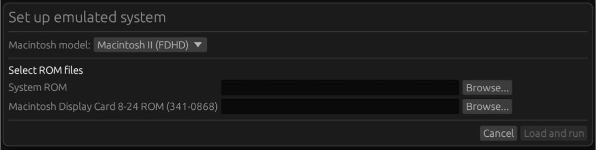

# Starting a system

## Obtaining ROM files
In order to emulate a Macintosh, you need a ROM file for the model you want
to emulate. You can obtain these from an original system you own or through
other means. I cannot help you to obtain ROMs.

## Loading a ROM file

You can simply drag a ROM into the emulator window to quickly run the
emulator. This starts the emulator with the default settings and does
not work for Macintosh II (as that needs a Display Card ROM).

### Through the 'Load ROM' dialog

To load a ROM file, go to 'Machine > Load ROM' in the menu or click the
memory icon in the toolbar.

In the dialog that comes up, select the Macintosh model you want to emulate
and browse for the system ROM.

To emulate the Macintosh II, you also need the ROM of the Macintosh Display
Card 8-24. This ROM is usually labeled 341-0868.bin.

Snow will validate whether your ROM file is correct for the selected model
and the integrity of the file.

check_circle indicates the
correct file was selected.

error indicates the selected
file is not correct. An error message will tell you what's wrong.

Once everything is good, you can click 'Load and run' to proceed. Snow will
remember the location of the ROM for each model so it is easy to launch
the same model next time.

### Advanced settings

In the 'Load ROM' dialog additional advanced settings can be configured:

 * Persist PRAM: loads and saves the RTCs PRAM into a file rather than
   starting blank and keeping it in memory.
 * Extension ROM: allows for loading an additional ROM into the extension
   ROM memory region of the emulated Mac.
 * Mouse emulation: see [mouse emulation](input.md#mouse).
 * Use 800K floppy drive on Macintosh 128K/512K: attaches an 800K,
   double-sided floppy drive to these models. This is non-standard but allows
   for emulating some interesting scenarios where these combinations do work.
 * Disable ROM validation: does not check whether the provided ROM file(s)
   are valid for the selected model. This allows for loading modified ROMs.
 * Start in fast-forward mode: see [debugging](debugging/).
